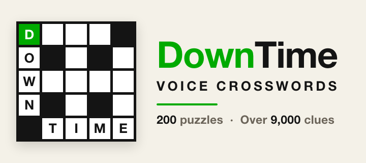
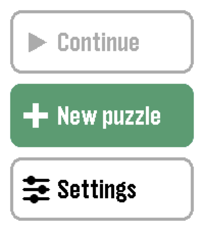
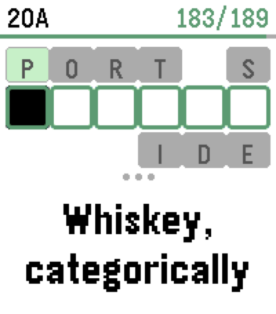
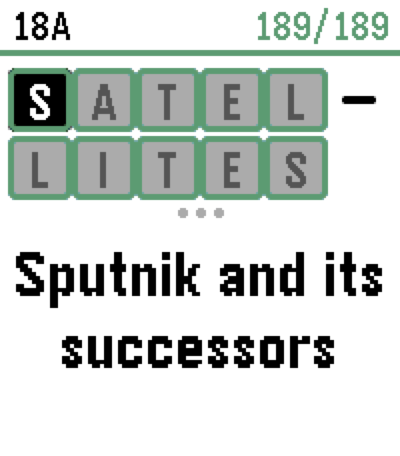
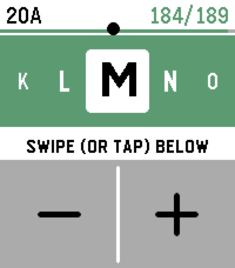

<p align="center">
  
</p>

# DownTime: Voice Crosswords for Pebble Time 2

An offline, voice-first crossword solver for the **Pebble Time 2** (emery).

A set of puzzles lives on the watch, so you can solve anywhere, phone or no
phone. The screen shows **one clue at a time** with its answer in boxes; you
**speak** an answer to fill it, or **type** by dragging across the clue. Answers
are never handed to you.

<table>
  <tr>
    <td align="center"><br><sub>Pick a puzzle</sub></td>
    <td align="center"><br><sub>A clue and its answer, crossing letters above and below</sub></td>
    <td align="center"><br><sub>Long answers wrap onto two rows</sub></td>
    <td align="center"><br><sub>Typing: swipe to scroll the alphabet</sub></td>
  </tr>
</table>

## Install

Grab the latest `pebble-crossword-vX.Y.pbw` from
[Releases](../../releases/latest) and side-load it with the Pebble app or the
CLI:

```bash
pebble install --phone <your-phone-ip>    # a real watch
pebble install --emulator emery           # the emulator
```

## Playing

**Choose a puzzle** from the home screen's three cards:

- **Continue** — everything you've started, with the time spent and how much is
  filled. The watch keeps your eight most recent.
- **New puzzle** — Mini (7x7) or Regular (15x15), then **Peaceful** (direct
  clues) or **Challenging** (trickier, misdirecting clues).
- **Settings** — how answers are checked, vibration, and the typing controls.

**The controls are the same everywhere — no modes.** One gesture, one meaning:

| Do this | And it |
| --- | --- |
| **SELECT** (press) | Speak the answer |
| **SELECT** (hold) | Menu: clear the word, all clues, reveal the word, or abandon |
| **UP / DOWN** | Previous / next clue that still needs letters |
| **Swipe up / down** | Previous / next clue |
| **Tap a square** | Focus it |
| **Tap the focused square again** | Jump to the word crossing there |
| **Tap the header** | The full clue list |
| **Drag left / right on the clue** | Open the letter picker to type |
| **BACK** | Close the picker (undoing the scroll), otherwise leave the puzzle (progress is saved) |

A first run walks you through this on three **Controls** cards, reopenable any
time from Settings.

### Speaking answers

Voice uses Pebble's free dictation, so it needs the phone connected. Say the
word, or spell it out ("bee oh why", "bravo oscar yankee", "B as in boy"). No
phone? Just drag to type instead.

### Typing answers

Drag left or right on the clue and a full-screen **picker** opens: the letter
you're on sits big in the middle with its neighbours either side. Drag across
the pad below to scroll the alphabet (a slow drag creeps a letter at a time; a
fast one flies), or tap the **+** / **−** halves to step one letter. Tap the
green band to keep the letter and move on. The bead on the progress bar shows
where in the alphabet you are.

### Checking

Set in Settings:

- **After every word** — a word is checked the moment it's complete. Right, it
  locks and flashes green; wrong, the mistaken squares turn red. Up/Down then
  step you through the words still to fix.
- **When the grid is full** — nothing is marked until the last square goes in,
  then you get your time, or the wrong squares to fix.

Either way, when everything's right you get a full-screen **SOLVED!** with your
time.

## The puzzles

The watch ships **200 original puzzles** — 100 minis (7x7) and 100 regulars
(15x15), split evenly between Peaceful and Challenging (50 of each per size).
No answer repeats more than a handful of times across the set. Every grid is
generated and every clue is written for this project; nothing is copied from a
published crossword.

Puzzles are stored as readable `.xd` files in [`puzzles/`](puzzles) and packed
into a single flash resource the watch reads one puzzle at a time. Generation
and clue tooling live in [`tools/lab/`](tools/lab); see its
[README](tools/lab/README.md) to build more.

## Building

```bash
pebble build                     # requires the Pebble tooling (uv tool install pebble-tool, SDK 4.33)
bash test/host/run.sh            # host C tests
node test/test_pkjs.js           # voice-matcher tests
```

CI builds for emery and runs the tests on every push; a `vX.Y` tag publishes a
`.pbw` release.

## Credits & license

The code is released under the **MIT License** (see [LICENSE](LICENSE)).

Puzzle **fill** is generated from the core wordlist of Nicole Feng's *MsFit
Crossword Dataset*
([nzfeng/crossword-dataset](https://github.com/nzfeng/crossword-dataset),
GPL-3.0), with thanks:

```
@misc{msfit-dataset,
  title  = {MsFit Crossword Dataset},
  author = {Nicole Feng},
  note   = {https://github.com/nzfeng/crossword-dataset},
  year   = {2022}
}
```

Because the bundled grids derive from that GPL-3.0 wordlist, the `.xd` files and
the packed blob carry GPL-3.0 terms if redistributed. All **clues** are this
project's own. Answer familiarity is scored, and clues are sanity-checked,
against Saul Pwanson's [xd clue corpus](https://xd.saul.pw/data) at generation
time only; that corpus is not redistributed here.
